<p align="center">
  
</p>

<p align="center">
  
  
  
</p>

### `> whoami`

I run email and lifecycle campaigns for a living: 11 years across financial services, retail media, automotive and telecom, mostly in **Adobe Campaign** and ad ops platforms. On the side I went deep on **data science and AI** at the University of Toronto, because I wanted to understand the numbers behind the campaigns, not just send them.

At night I'm directing **EXIOS**, a sci-fi real-time strategy game built in Godot with AI-assisted development. I handle the story, design and balance; the AI writes most of the code.

### `> ls ./projects`

| | Project | What it shows |
|---|---|---|
| 📬 | **[email-campaign-analytics](https://github.com/ketankhanna/email-campaign-analytics)** | Campaign scorecards, YoY trends, EN/FR split, and A/B tests with real significance testing |
| 🚦 | **[toronto-collision-severity](https://github.com/ketankhanna/toronto-collision-severity)** | Nine ML models and grid-search tuning on Toronto Police open collision data (team project) |
| 🐍 | **[snake-dqn-agent](https://github.com/ketankhanna/snake-dqn-agent)** | A deep Q-learning agent that teaches itself to play Snake |
| 🦷 | **[dental-xray-classifier](https://github.com/ketankhanna/dental-xray-classifier)** | ResNet50 and VGG16 transfer learning vs. a custom CNN on medical images, and why the small one won (team project) |
| 🏹 | **[wumpus-bayesian-agent](https://github.com/ketankhanna/wumpus-bayesian-agent)** | A probabilistic agent that reasons about hidden dangers with a Bayesian network |
| 🎲 | **[probability-simulations](https://github.com/ketankhanna/probability-simulations)** | Monty Hall and the Birthday Paradox, settled by simulation |

### `> cat toolbelt.txt`

<p>
  
  
  
  
  
  
  
  
  
</p>

### `> status`

```text
[■■■■■■■■■■] day job ........ shipping campaigns, 3-4 a week
[■■■■■■■□□□] EXIOS .......... Act 1 in progress
[■■■■□□□□□□] portfolio ...... you're looking at it
[■■■■■■■■■■] coffee ......... critical dependency
```

<p align="center"><sub>English · Français &nbsp;|&nbsp; Toronto, Canada</sub></p>
