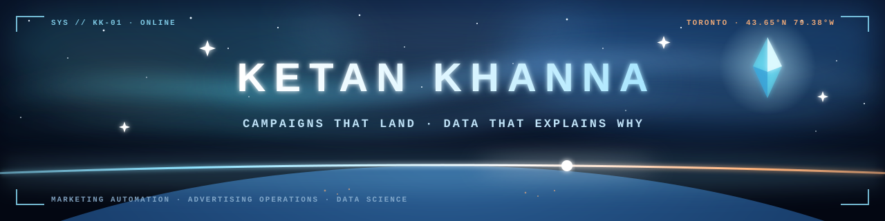

<p align="center">
  
</p>

<p align="center">
  
  
  
  
</p>

### `> whoami`

Marketing technologist with 11 years across **Advertising Operations** and email and lifecycle marketing. On the advertising side I ran retail media and digital ad operations at scale: over 1,000 campaigns and $20MM in managed spend across retail media, automotive and media. Today I build and deploy campaigns in **Adobe Campaign**.

I completed certificates in **Data Science** and **Artificial Intelligence** at the University of Toronto (4.0 GPA in both) to understand the data behind every campaign, not just deliver it.

I'm also the founder of **Cinderhawk Games**, where I'm directing **EXIOS**: a sci-fi real-time strategy game built in Godot. I lead the story, design and balance, with AI-assisted development for the code.

### `> ls ./projects`

**Featured Projects**

| | Project | What it shows |
|---|---|---|
| 📬 | **[email-campaign-analytics](https://github.com/ketankhanna/email-campaign-analytics)** | Campaign scorecards, year-over-year trends, language splits and A/B tests with proper significance testing |
| 🚦 | **[toronto-collision-severity](https://github.com/ketankhanna/toronto-collision-severity)** | Nine ML models and grid-search tuning on Toronto Police collision data (team project) |
| 🐍 | **[snake-dqn-agent](https://github.com/ketankhanna/snake-dqn-agent)** | A deep Q-learning agent that teaches itself to play Snake |
| 🦷 | **[dental-xray-classifier](https://github.com/ketankhanna/dental-xray-classifier)** | ResNet50 and VGG16 transfer learning vs a custom CNN on dental X-rays, and why the small model won (team project) |
| 🏀 | **[nba-rookie-forecasting](https://github.com/ketankhanna/nba-rookie-forecasting)** | Predicting a player's career-high PER from their first three seasons (team project) |
| 😊 | **[world-happiness-regression](https://github.com/ketankhanna/world-happiness-regression)** | What makes a country happy? Freedom, GDP and health explain 75% of the variation (team project) |
| 🚢 | **[titanic-survival-eda](https://github.com/ketankhanna/titanic-survival-eda)** | Who survived the Titanic, and why |
| 🏹 | **[wumpus-bayesian-agent](https://github.com/ketankhanna/wumpus-bayesian-agent)** | A probabilistic agent that reasons about hidden dangers with a Bayesian network |
| 🎲 | **[probability-simulations](https://github.com/ketankhanna/probability-simulations)** | Monty Hall and the Birthday Paradox, settled by simulation |

**University of Toronto Coursework**

| | Course | Highlights |
|---|---|---|
| 🧠 | **[deep-learning-coursework](https://github.com/ketankhanna/deep-learning-coursework)** | Keras tuning, VGG16 transfer learning, TF-IDF vs GloVe vs BERT search and a variational autoencoder |
| 🤖 | **[intelligent-agents-coursework](https://github.com/ketankhanna/intelligent-agents-coursework)** | Wumpus World agents that go from random to path-planning to Bayesian |
| 📈 | **[machine-learning-coursework](https://github.com/ketankhanna/machine-learning-coursework)** | Pipelines, classification, clustering, regularisation, ensembles, PCA and t-SNE |
| 📊 | **[statistics-for-data-science](https://github.com/ketankhanna/statistics-for-data-science)** | Permutation tests, hypothesis testing and Bayesian MCMC |
| 🧮 | **[foundations-of-data-science](https://github.com/ketankhanna/foundations-of-data-science)** | Financial time series and kNN classification |
| 🗄️ | **[big-data-systems](https://github.com/ketankhanna/big-data-systems)** | MongoDB, Hadoop and Spark on Databricks |
| 📣 | **[marketing-strategy-portfolio](https://github.com/ketankhanna/marketing-strategy-portfolio)** | Brand positioning, creative briefs, media plans and marketing mix case studies |

<sub>Coursework is labelled throughout: ✅ original work · 👥 team project · 🔧 Claude correction · 🤖 completed afterwards with Claude.</sub>

### `> cat toolbelt.txt`

<p>
  
  
  
  
  
  
  
  
  
</p>

### `> status`

```text
[■■■■■■■■■■] day job ........ deploying campaigns, 3-4 a week
[■■■■■■■□□□] EXIOS .......... Act 1 in progress
[■■■■□□□□□□] portfolio ...... you're looking at it
[■■■■■■■■■■] coffee ......... critical dependency
```

<p align="center"><sub>English · Français &nbsp;|&nbsp; Toronto, Canada</sub></p>
